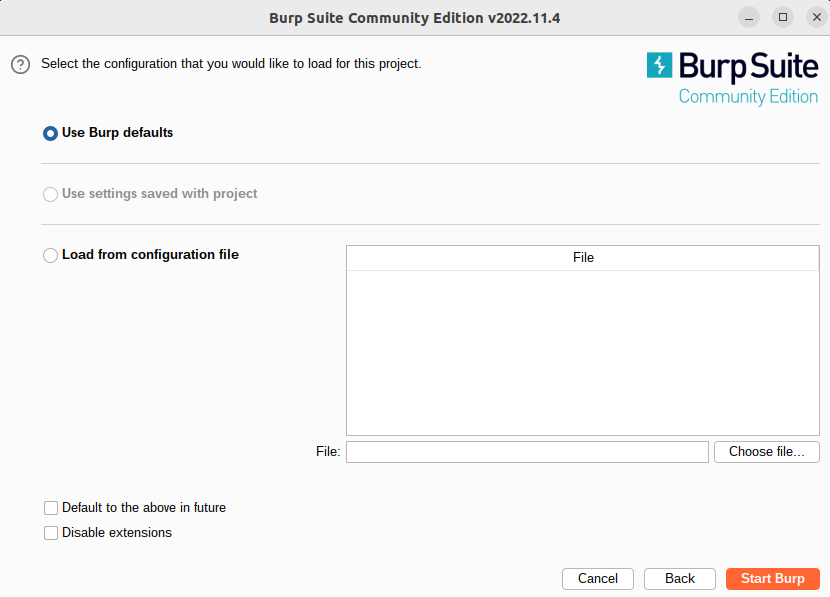
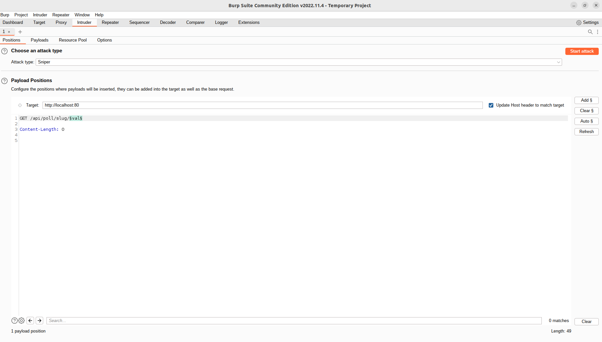
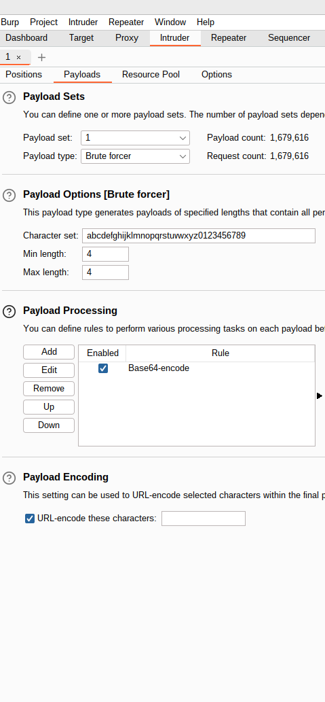
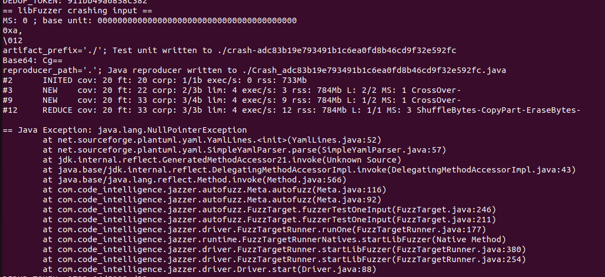

# Fuzzing
## Introduction
Fuzzing is a way of testing applications by providing random data as input trying to trigger errors such as exceptions, memory leak, stack smashing, double free or even higer level flaws such as sql injection.

Fuzzing can be applied to various type of systems : API, binaries, web apps..

Fuzzing is primarily used in two fields : V&V and Security  
Depending on the objectives the data generation techniques vary :  
- Grammar
- Dictionnary
- random mutators

## Fuzzing Doodle

Doodle is an application with multiple surface attack.  
We could choose to fuzz :
- The API
- The back-end binaries

## Fuzz the API

### Using Burp Suite  
Burp Suite is a paid software with a free limited version. Its purpose is to do penetration testing of web application. The intruder feature enables us to fuzz our Doodle API.

After downloading Burp, you can open it and create a new project or a temporary project :  
  
  
  
Choose default settings :  
  
  
  
Go to the "Intruder" tab and set up the HTTP request and choose what variable you will fuzz :  
  
  
  
Then in the Payload tab choose how to generate data :  
  
  
  
You can now launch the "attack" and check the server response.
You can use this tool to either check if your API works as intended, or, to try find bugs.  

### Using a custom script (Python)  
If no off the shelf software meet your needs, you can easily build custom script to fuzz your API  
```python
import requests
import random
import string

NUMBER_OF_TRY = 100

def get_random_string(length):
    # choose from all lowercase letter
    letters = string.hexdigits
    result_str = ''.join(random.choice(letters) for i in range(length))
    return result_str

# Define the URL of the API you want to fuzz
api_url = "http://localhost:4200/api/pool/slug/"


# Define a list of input values to use for fuzzing the API
fuzz_values = [get_random_string(24) for i in range(NUMBER_OF_TRY)]


# Iterate over the list of fuzz values and make a request to the API for each value
for val in fuzz_values:
    # Make a GET request to the API using the current fuzz value as a query parameter
    response = requests.get(api_url, params={"fuzz_param": val})

    # Print the status code of the response
    print(f"Response for fuzz value {val}: {response.status_code}")
```  
  
this script is calling the API trying to find hidden pool.

```
Response for fuzz value 538BEB050aAbEE2E788eB988: 404
Response for fuzz value FCb2eCd5175F8E69fcd3dcF4: 404
Response for fuzz value eA47ecbd2eBe57393Eb7b2D7: 404
Response for fuzz value 2f0b85c6A83094bEa1b47aBa: 404
Response for fuzz value 1f83332CD7fDBBFC74c7d596: 404
Response for fuzz value 4F63a34CbeBDAdD89bE15cc2: 404
Response for fuzz value 6D53D03a1F2Db4B330Afd72E: 404
Response for fuzz value 57D7bdAb1FFE4a45eF7Ba7Cb: 404
Response for fuzz value B73b0F2B6Bd3Cb844FD77C40: 404
Response for fuzz value c03fEBaAd2E84F2FEDDbEA6F: 404
Response for fuzz value 0eC0EA9Fd8F802DdbB4C32eF: 404
Response for fuzz value 7cEC2eBA2c8CaA7e450Bf633: 404
Response for fuzz value 4DB83db2ed15D5da820fCeA0: 404
Response for fuzz value CA2C4999d1fE4eF654fbA763: 404
Response for fuzz value 9fE25DfFDFaFf23f5b4269D8: 404
```

This is a fraction of the result we get. Since we did not find any hidden pool we receive 404 errors.  
  
## Fuzz the backend binary 

To fuzz our backend, we will use Jazzer. Jazzer is a fuzzer working with JVMs. The fuzzer will try to cover as much code as possible by using JVMs features to know what is the code coverage acheived by each input data.  
The basic usage is to use the autofuzz fonctionality and let Jazzer decide what input and what mutators to use.  

In the case of doodle we have not to forget to lauch the etherpad and database dockers.  

```./jazzer --cp=./tlcdemoApp-1.0.0-SNAPSHOT.jar --autofuzz=org.apache.commons.imaging.Imaging::getBufferedImage```  
  
if jazzer find a bug it will save the raw input in a file and also a java code to reproduce the crash and easily turn it into a junit test case.  
  

And the generated java code :  
```java
public class Crash_adc83b19e793491b1c6ea0fd8b46cd9f32e592fc {
  public static void main(String[] args) throws Throwable {
    (((java.util.function.Supplier<net.sourceforge.plantuml.yaml.SimpleYamlParser>) (() -> {net.sourceforge.plantuml.yaml.SimpleYamlParser autofuzzVariable0 = new net.sourceforge.plantuml.yaml.SimpleYamlParser(); return autofuzzVariable0;})).get()).parse((java.util.List) null);
  }
}
```  

If needed you can check the documentation to create more fine grained fuzzing target and build your own data generator.  

## Conclusion  
Fuzzing is way to test or attack software or API. For an in depth view on this subject you can check the fuzzing book https://www.fuzzingbook.org/ 
