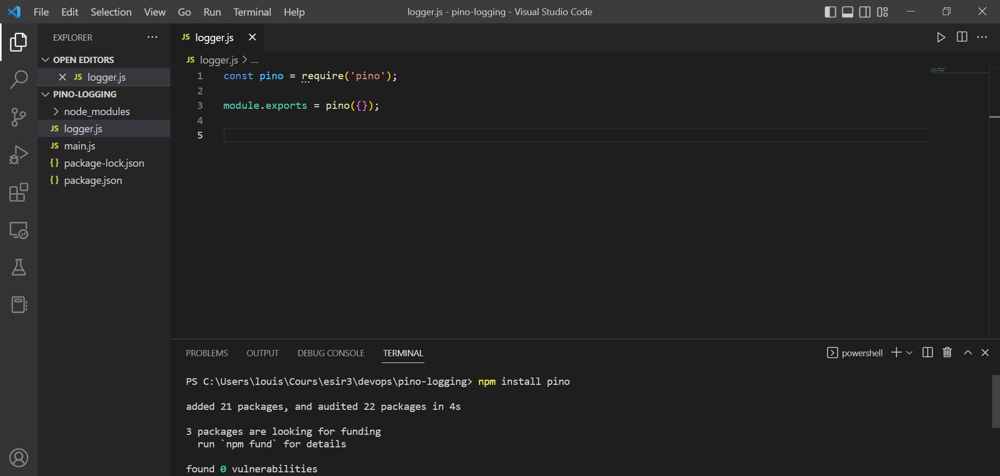
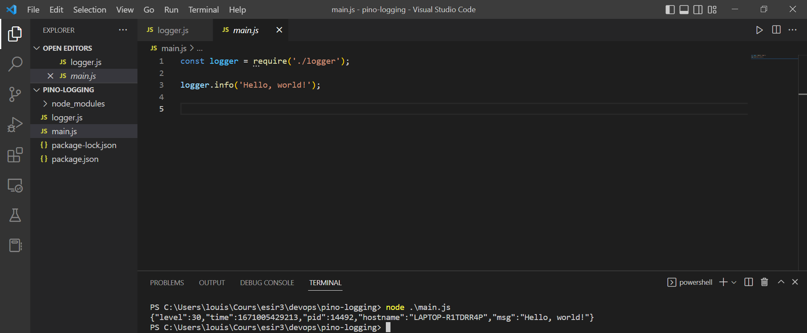

# Devops_Project  -  Logging, tracing, monitoring and observability


## Introduction 

Ce projet consiste à mettre en place différents outils de journalisation et d'observabilité sur un code source.
Grace à cela, nous espérons prendre en main ces outils et comprendre en quoi ils sont nécessaire lors du développement d'un projet.

## Membres

Arthur Sauvage - arthur.sauvage@etudiant.univ-rennes1.fr

Louis Conan - louis.conan@etudiant.univ-rennes1.fr

Pierre Martin - pierre.martin@etudiant.univ-rennes1.fr

## Plan provisoire

1- Logging

2- Log Infrastructure

3- Log Analysis

## Ressources
https://github.com/selabs-ur1/devops/issues/13

## Logging

Aujourd'hui, certains développeurs utilisent console.log pour faire du "logging". Cependant, cette commande ne fait qu'afficher sur la console les informations que l'on veut. Le plus gros inconvénient de cette méthode est qu'elle n'impose pas un format commun. On peut donc logger ce que l'on veut et comme on le veut. Cela illustre les limites de cette commande.

Il est donc préconisé d'utiliser des outils adaptés pour faire du logging. Nous avons choisi dans cette sous-partie de vous faire un getting started un framework de logging pour nodejs : Pino.

### Prérequis

Il est nécessaire de vérifier que vous avez une version récente de nodejs : 
```
node -v
```
et que npm soit installée localement sur votre machine. Si ce n'est pas le cas, exécutez la commande : 

```
npm install
```

### Getting started with Pino

Créez un nouveau répertoire où vous allez initier un projet nodejs avec la commande : 

```
npm init -y
```

Ensuite, installez le package pino :

```
npm install pino
```

Créez un fichier logger.js pour exporter une installer logger grâce à la fonction Pino : 



Puis créez un fichier mains.js pour utiliser l'instance logger exportée et exécutez le pour voir le log : 



On peut observer que par défaut, le format du log est en JSON, qui et le format standard des logs dans un contexte de production. 

## Log Infrastructure

L'infrastucture supportant le processus d'analyse joue un rôle important car l'analyse implique l'agrégation et la sélection de grands volumes de données. Les exigences pour le traitement des données dépend de la nature de l'analyse et de la nature des données du journal. L'infrastructure des Logs s'occupe des outillages utiles pour rendre l'analyse la plus approfondie possible. 

On distingue l'analyse et le stockage des journaux.

### Analyse des journaux

Le principal défi est d'identifier les messages du journbal qui décrivent un évènement identique. Ce processus consiste donc à identifier les parties constantes et variables des messages brutes. On voit par exemple des méthodes tels que des dictionnaires de tous les mots qui apparaissent dans le message de journal qui utilisent la fréquence de chaque mot pour regrouper les messages du journal. Ou encore, un dictionnaire à partir des mots-clés qui apparaissent dans les journaux. Les résultats suggèrent que Hadoop est mieux adapté à l'analyse hors ligne tandis que Spark est mieux adapté à l'analyse en ligne.
Une autre approche pour réduire les coûts de stockage consiste à compresser les données pour une analyse. Cependant, certains affirment que si la compression traditionnelle des données les algorithmes est utile pour réduire l'encombrement du stockage, la boucle de compression-décompression pour interroger les données compromet l'efficacité de l'analyse des logs.


### Stockage des journaux

Les systèmes complexes modernes génèrent facilement des giga ou des pétaoctets de données de journal par jour. Ainsi, dans le cycle de vie des données du journal, le stockage joue un rôle important car, s'il n'est pas manipulé avec soin, il peut devenir le goulot d'étranglement du processus d'analyse.
Pour résoudre ce problème, on a identifié 2 solutions rapide fonctionnant sur le même pricipe d'externalisation du stockage des journaux : Apache Spark et Apache Hadoop. 

## Analyse des logs

Pour garder un système sûr et sécurisé, il est critique de détecter rapidement des anomalies dans le système.
Un système de log permet de sauvegarder des états du système et des événements significatifs à des points importants afin d'aider le débogage ou d'apporter des informations.
Les logs sont une ressource précieuse pour comprendre un système et il est important de les analyser. Au vu du nombre souvent très important de ces logs, il faut passer par des algorithmes pour tous les analyser.
Ici nous vous proposons d'utiliser l'outil DeepLog afin de détecter des anomalies dans les logs de votre système.

DeepLog est un modèle de Deep Learning utilisant le framework Pytorch. On peut l'utiliser directement ou alors l'entrainer avec de nouvelles données pour améliorer ses prédictions sur ses données.

Pour installer le package, on utilise pip :

```
pip install deeplog
```

On peut utiliser l'outil soit par ligne de commande soit dans du code python.

### Ligne de commande

Pour l'entrainer on utilise l'argument train et les hyperparamètres de son choix.
Exemple avec un fichier .csv de logs.

```
python3 -m deeplog train --csv data_train.csv --batch-size 64 --epochs 20 --device cpu --save deeplog.save
```

Pour la partie prédiction, on utilise l'argument predict et le modèle de son choix.

```
python3 -m deeplog predict --csv data_predict.csv --load deeplog.save
```

Les logs anormaux seront séparés des logs normaux.


### Code python

On peut aussi utiliser DeepLog en code python.

Exemple :


