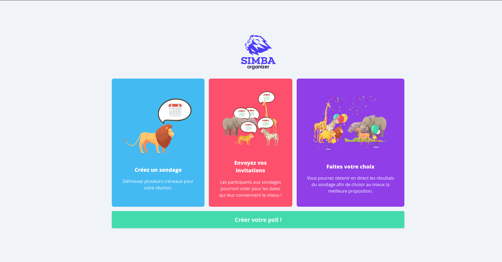
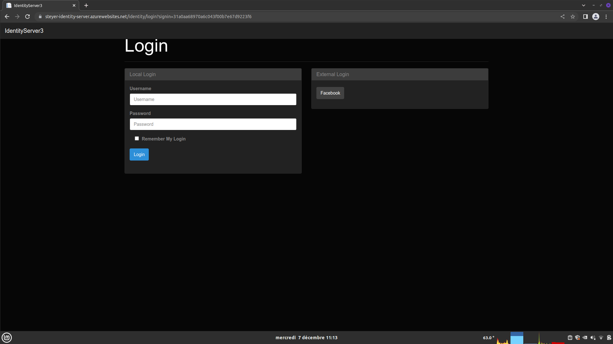
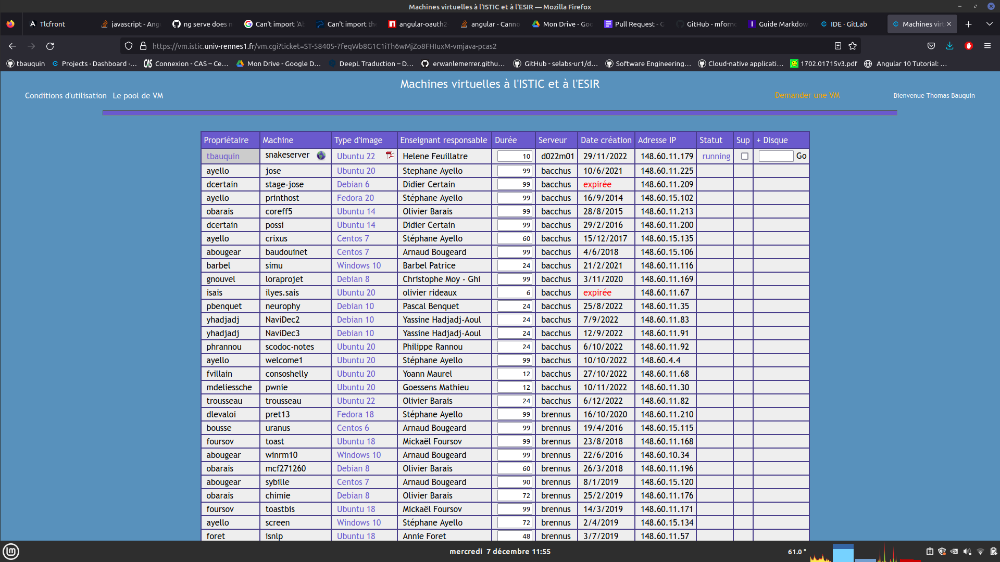
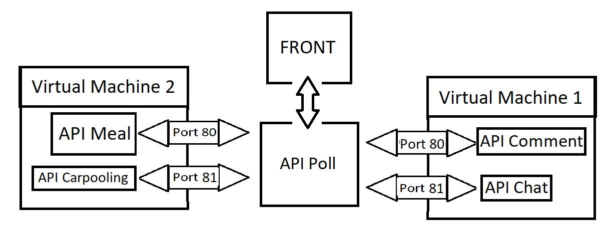

# Pull Request DLC

Bauquin Thomas - Diamant Marius - Le Brun Briag - Nicolas Elouan

L'objectif de ce TP était d'implémenter dans un projet des outils appartenant au thème des Applications Cloud Native et des Architectures en Microservices.



Pour cela, nous sommes partis du projet **Doodle Student**, une application permettant de créer et organiser des évennements et des réunions. Cette application est microservicisée, utilise un back développé en Quarkus, et qui orchestre les microservices, plusieurs microservices développé en Nest JS et un front développé en Angular.

Pour ce TP, nous avons décidé d'ajouter un service d'authorisation à l'application en utilisant **OAuth2** et **OpenIdConnect**.

Nous avons également décider de déployer quatre des microservices sur des machines virtuelles de l'istic.

## Comment utiliser l'application
L'application est divisée en deux parties : le backend et le frontend.

### Front-End
#### Prerequis
- `npm` installé, pour l'installer  `sudo apt install npm` pour Ubuntu and pour Red-Hat `sudo dnf install npm`.

#### Installer

Dans le dossier front, lancer `npm install` pour télécharger les dépendances puis lancer `ng serve` pour lancer le serveur.

Vous pouvez désormais vous connecter à l'adresse http://localhost:4200/   .
Pour l'instant, c'est impossible d'utiliser l'entièreté de l'application car il faut lancer le backend.

### Back-end
Le backend utilise plusieurs microservices. Pour lancer le backend, il faut lancer le script `./launchApp.sh`. Il faut au préalable, modifier ce fichier avec les bons chemins. 

#### Prerequisite
- JDK11
- Docker
- Docker-compose

#### Authentification

La partie authentification utilise les technologies OAuth2 et OpenIdConnect.

#### OAUth

OAuth est un protocole libre qui permet aux développeurs d’une application (web ou logicielle) d’implémenter un accès sécurisé (par authentification) à un service tiers. Il permet ainsi à l’utilisateur d’utiliser les informations d’un autre site web ou application (son compte Google par exemple, site “fournisseur”) sur notre site web (site “consommateur”). Et cela, sans partager son nom d'utilisateur et son mot de passe avec l'application tiers.

#### OpenID Connect

OpenID Connect 1.0 est une couche d'identité simple qui s'ajoute au protocole OAuth 2.0. Elle permet aux clients de vérifier l'identité de l'utilisateur final sur la base de l'authentification effectuée par un serveur d'autorisation, ainsi que d'obtenir des informations de base sur le profil de l'utilisateur final d'une manière interopérable et de type REST.

OpenID Connect permet aux clients de tous types, y compris les clients Web, mobiles et JavaScript, de demander et de recevoir des informations sur les sessions et les utilisateurs finaux authentifiés. La suite de spécifications est extensible, ce qui permet aux participants d'utiliser des fonctions facultatives telles que le cryptage des données d'identité, la découverte des fournisseurs OpenID et la déconnexion, lorsque cela s'avère utile pour eux.

Le bouton login redirige vers un server distant gérant l'authentification (Identity Provider). Le serveur d'authenfication utilisé est un serveur créé arbitrairement avec un seul utilisateur ajouté : identifiant : **max**, mot de passe : **geheim**.



Une fois la personne connectée, la personne obtient un token et elle est redirigée vers le composant Angular `Home` de l'application. 


## Comment créer une VM ISTIC

Sur https://vm.istic.univ-rennes1.fr/, faire une demande de création de VM avec Ubuntu comme OS. Un mail est ensuite envoyé. Il indique différents détails sur le fonctionnement des VM et comment changer le mot de passe par défaut.



Pour accéder à la VM, il faut être connecté au réseau de l'Istic, et se connecter via la commande SSH : ssh Identifiant@AdresseIP 

ex: `ssh zprojet@XX.XX.XX.XX`. Il faut ensuite entrer le mot de passe de la VM.

## Comment migrer et déployer un micro service sur la vm

Les 4 micros services fonctionnant dans le cloud (VM de l'ISTIC)  sont développés en NestJS. Pour les déployer sur les VM, nous devons installer sur les VM `PM2` via NPM.

`sudo npm install -g pm2`

PM2 est un gestionnaire de processus pour les applications Node.js. Il permet de gérer et de maintenir en fonctionnement les applications Node.js en les exécutant en arrière-plan de manière permanente, tout en offrant des fonctionnalités avancées telles que la surveillance en temps réel, la répartition de la charge sur plusieurs CPU, la journalisation en temps réel et l'intégration avec des services de surveillance pour détecter les problèmes et en avertir les administrateurs. PM2 est un outil pratique pour les développeurs et les administrateurs système qui souhaitent gérer efficacement des applications Node.js en production.

On construit nos microservices pour les rendre exécutable :

`npm run build`

Nous déployons le service :

`pm2 start npm --name "app-name" -- start`

Maintenant pour qu'il soit accessible depuis l'extérieur, nous allons installer et configurer Apache :

`sudo apt install apache2`

Apache est un serveur Web open source utilisé pour héberger des sites Web et des applications en ligne. Il permet de gérer les requêtes HTTP entrantes et de fournir des pages Web et d'autres contenus aux utilisateurs via un navigateur Web. Apache est connu pour sa fiabilité, sa flexibilité et sa capacité à s'adapter à des environnements de serveur variés. Il est souvent utilisé en conjonction avec d'autres technologies Web telles que PHP et MySQL pour construire des sites Web dynamiques et interactifs.

On active les deux modules proxy et proxy_http :

`sudo en2mod proxy`

`sudo a2enmod proxy_http`

Pour appliquer les modifications, on relance Apache :

`sudo service apache2 restart`

Pour rendre accessible le service, il faut modifier le fichier de configuration d'Apache :

`sudo nano /etc/apache2/sites-available/domain.conf`

``` xml
<VirtualHost :80>
    ServerName domain.com => ServerName ip-address-vm
    ServerAlias www.domain.com => ServerAlias url-vm-istic

    ProxyRequests Off
    ProxyPreserveHost On
    ProxyVia Full

    <Proxy>
        Require all granted
    </Proxy>

    ProxyPass / http://localhost:3000/
    ProxyPassReverse / http://localhost:3000/
</VirtualHost>

```

Enregister les mofifications et relancer Apache :

`sudo a2ensite domain.conf`

`sudo service apache2 restart`

Les services communiquent ainsi via requêtes HTTP (Get, Post ...).


## Comment les systèmes communiquent entre eux

Le micro service Poll qui est le service principal de cette application joue le role d'orchestrateur des autres micros services.

Le front et l'api Poll sont lancés en local et communique avec les différentes api déployées sur les VM.




